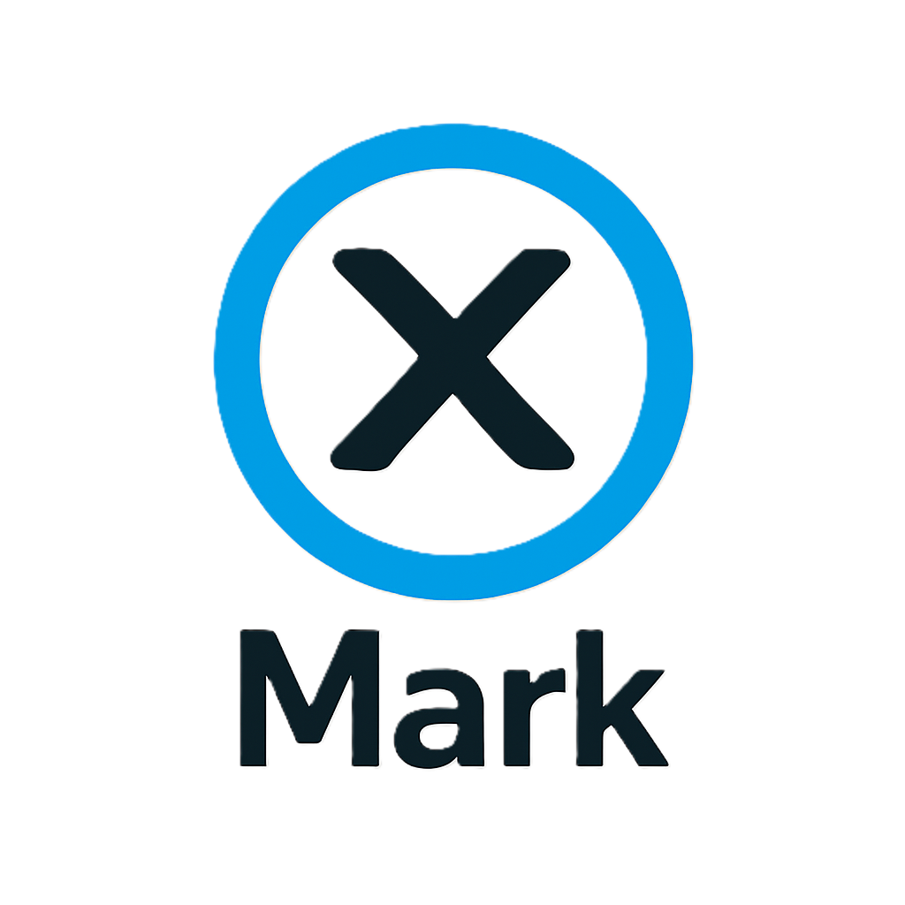

<p align="center">
  
</p>

<h1 align="center">XMark</h1>

<p align="center">专为 X（前推特）打造的备注 · 截图 · 广告过滤 Chrome 扩展</p>

<p align="center">
  <a href="#"></a>
  <a href="https://developer.chrome.com/docs/extensions/mv3/intro/"></a>
  <a href="#"></a>
  <a href="LICENSE"></a>
</p>

<p align="center">
  🌐 <a href="README.md">中文</a> · <a href="README.en.md">English</a>
</p>

---

## 🌟 简介

**XMark** 是一款专为 **X（前推特）** 打造的浏览器扩展，集**用户备注**、**推文截图**、**广告过滤**于一体。轻巧灵动，帮你记住每一个账号、留住每一条精彩、屏蔽纷扰广告，形成你个人的 X 知识库。

## ✨ 功能特点

- 📝 **用户备注** — 为任意 X 用户添加个性化备注（如「重点关注」「潜在合作」「存疑账号」），在信息流与主页醒目展示
- 📸 **推文截图** — 一键捕获长推文，支持保存到本地 / WebDAV / 内置时间线数据库
- 🗂 **时间线** — 所有截图自动归档，可按用户 / 日期 / 分类 / 关键词检索，配热力图回顾活跃度
- 🏷 **标签管理** — 标签分类、拖拽排序、按标签筛选用户、标签独立导入导出
- 🚫 **广告过滤** — 自动识别并隐藏信息流广告推文，去广告数量（今日 / 总计）一目了然
- 🧹 **界面净化** — 自定义隐藏左侧菜单项（探索 / Grok / Premium / Money / 文章 / 关注 / 创作者工作室 / 更多）、右侧边栏与广告推文；一键清爽左栏，勾选即时生效
- ☁️ **WebDAV 云备份** — 支持坚果云、Nextcloud、ownCloud 等，可按小时 / 天 / 周 / 月自动备份，凭据加密存储
- 🔒 **安全** — XSS 防护、WebDAV SSRF 收口、凭据加密、扩展重载容错（v6.0.0 安全加固）
- 🌐 **中英双语** — 完整国际化支持，一键切换

## 🚀 快速开始

```bash
git clone https://github.com/jaxo4life/XMark.git
```

或直接 [下载 ZIP](https://github.com/jaxo4life/XMark/archive/refs/heads/main.zip) 解压。然后：

1. 打开 Chrome，访问 `chrome://extensions/`
2. 开启右上角 **开发者模式**
3. 点击 **加载已解压的扩展程序**，选择项目文件夹
4. 打开 [x.com](https://x.com)，开始使用 🎉

## 🗣️ 特别提醒

第一次为用户添加备注时，若不在该用户主页，会弹出小窗自动打开其主页以获取唯一数字 ID（用于持久标识，避免用户改名后备注丢失）。详见 [content.js](content.js) 的 `fetchUserIdFromProfile`。

## 📋 更新日志

详见 [CHANGELOG.md](CHANGELOG.md)。

## 🤝 贡献与反馈

欢迎提交 [Issue](https://github.com/jaxo4life/XMark/issues) 或 Pull Request。

## 📄 许可证

[GPL v3](LICENSE)
